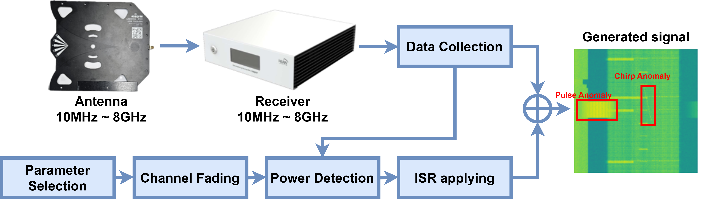

# WASD: Wireless Anomaly Signal Dataset

WASD is a wireless anomaly dataset for spectrum-level anomaly detection in fixed urban environments. It combines measured LTE/5G signals with synthetic anomaly overlays (tone, chirp, pulse) for detection and localization tasks.

## Paper
- IEEE Access (2024): https://ieeexplore.ieee.org/document/10813361
- DOI: `10.1109/ACCESS.2024.3521946`

## Related Works
- Kim et al., "Spectrum Anomaly Detection Using Deep Neural Networks: A Wireless Signal Perspective", IEEE Access (2025): https://doi.org/10.1109/ACCESS.2025.3603216
- Kim et al., "Anomaly Detection for Wireless Cellular Communication based on Synthetic Anomaly", IEEE Access (2025): https://doi.org/10.1109/ACCESS.2025.3584113

## Highlights
- Real-world measurements over 19 LTE/5G bands.
- Synthetic anomalies: tone, chirp, pulse.
- Channel/fading-aware synthesis following practical assumptions.
- 85,500 spectrogram samples total (19 bands x 4,500 samples/band).
- Bounding-box labels for anomaly localization.




## Repository Contents
```text
.
|-- WASD_data_loader.ipynb
|-- WASD_abnormal_signal_generation.ipynb
|-- images/
|-- LICENSE
`-- README.md
```

## Dataset Packaging (Full Release)
```text
Dataset/
|-- IQ data.zip
|   `-- <band_name>/
|       |-- bin/
|       |   `-- IQ_<timestamp>.bin
|       `-- IQ_<timestamp>.json
`-- npy data.zip
    |-- Abnormal/
    |   |-- Abnormal_spectrogram.npy
    |   `-- label/Spectrum_label.csv
    `-- Normal/
        `-- Normal_spectrogram.npy
```

## Data Notes
- Each `.npy` file stores spectrogram matrices.
- `Spectrum_label.csv` can contain multiple bounding boxes per spectrogram.
- The number of bounding boxes can exceed the number of spectrogram samples.

### IQ Calibration Note
- `iq_level_offset`: correction offset applied to raw ADC-domain IQ power.
- `reference_level`: reference level used for absolute calibration.
- Typical conversion path: apply `iq_level_offset` to convert scale, then convert to dBm as defined by measurement metadata.

## Notebooks
- `WASD_data_loader.ipynb`
  - Example loading of IQ binary, spectrogram `.npy`, and label `.csv`.
- `WASD_abnormal_signal_generation.ipynb`
  - Example synthesis of tone/chirp/pulse anomaly signals and time-frequency visualization.

## Access Links
- IEEE DataPort (split dataset for quick evaluation):
  - https://ieee-dataport.org/open-access/wasd-wireless-anomaly-signal-dataset

- Google Drive (full dataset chunks):
  - [Chunk 1](https://drive.google.com/file/d/1055_Mqq3iJJLVsYirFbKue0vz0quemtd/view?usp=drive_link)
  - [Chunk 2](https://drive.google.com/file/d/1upenUkhVKsFYPYQg494ShImL_CmGgNYz/view?usp=drive_link)
  - [Chunk 3](https://drive.google.com/file/d/1-7em96OKb4u4f3bOmnKWqq0iEe4bD19L/view?usp=drive_link)
  - [Chunk 4](https://drive.google.com/file/d/1-8aqUargGx4K7RKx2O1rs-8s2_fH_AcW/view?usp=drive_link)
  - [Chunk 5](https://drive.google.com/file/d/1-CE2wfaSP_YbT407otkhS8055aF7o4WQ/view?usp=drive_link)
  - [Chunk 6](https://drive.google.com/file/d/1-PAfbavHwuxadLDEGF_Z-1L98mA8PON_/view?usp=drive_link)
  - [Chunk 7](https://drive.google.com/file/d/1-PDV_f4nPDJ8e_lfiNmcwHo3THlPvyU2/view?usp=drive_link)
  - [Chunk 8](https://drive.google.com/file/d/1-U_sTYDjCbRbm5eeK006iardzKrBWin0/view?usp=drive_link)
  - [Chunk 9](https://drive.google.com/file/d/1-Wi8xFGUZfHc9TYjzXKi2fwf7x1m7Ohu/view?usp=drive_link)
  - [Chunk 10](https://drive.google.com/file/d/1-_B0sLQ61jJpMn6cOZ0_IMfJ0hRTctiV/view?usp=drive_link)
  - [Chunk 11](https://drive.google.com/file/d/1-mD1_fsuGHbCXHD1qJWSJWNJdu_-boMZ/view?usp=drive_link)
  - [Chunk 12](https://drive.google.com/file/d/1-o3vpVnyXtH7Sn1XTrh9qWsm7YEDlYzg/view?usp=drive_link)
  - [Chunk 13](https://drive.google.com/file/d/1-p11FzRVo39UbC3hmNvJ7kRCb3cjzpKS/view?usp=drive_link)
  - [Chunk 14](https://drive.google.com/file/d/1-q3CHKay2m4rYgQmyqq6iri1yTxzM08M/view?usp=drive_link)
  - [Chunk 15](https://drive.google.com/file/d/1-tBtRYcj7R8eSEEjfwogvL5LjMy_Az3i/view?usp=drive_link)
  - [Chunk 16](https://drive.google.com/file/d/1-wrPQnoMvevT5XlLmAoMzeUeiuodpftp/view?usp=drive_link)

## Authors
- Jinha Kim: `jinha.kim@o.cnu.ac.kr`
- Hyeongwoo Kim: `hyeongwoo.kim@o.cnu.ac.kr`
- Byungkwan Kim: `byungkwan.kim@cnu.ac.kr`

## Acknowledgement
This work was supported by MSIT/IITP through the ICT R&D program (`RS-2023-00229541`).
